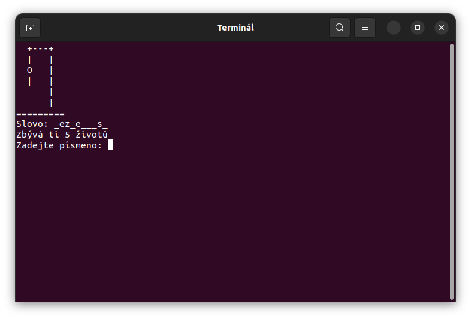

# Obesenec

Tento skript představuje hru "Oběšenec" v bashi. Hra načte slova ze souboru slova.txt a vybere náhodné slovo, které se hráč snaží uhádnout. Hráč má 6 životů a pokud neuhádne slovo do té doby, prohrál.

## Instalace

    Stáhněte si skript a soubor se slovy.
    Spusťte skript pomocí příkazu bash obesenec.sh

## Použití

Hráč zadává jedno písmeno a skript zkontroluje, zda se písmeno v daném slově nachází. Pokud ano, písmeno se zobrazí ve slově, které se zobrazuje hráči. Pokud ne, odečte se hráči jeden život. Hra končí, pokud hráč uhádne slovo nebo pokud mu dojdou životy.

## Screenshot

## Poznámky

    Skript využívá IFS=$'\n' k nastavení oddělovače řádků pro pole HANGMANPICS, aby se zobrazovaly správně obrázky oběšence.
    Skript také využívá readonly k označení pole HANGMANPICS jako readonly, aby se zabránilo jeho změně během hry.